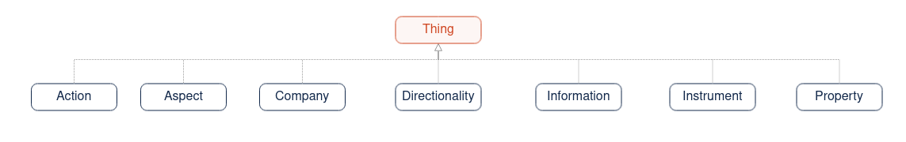
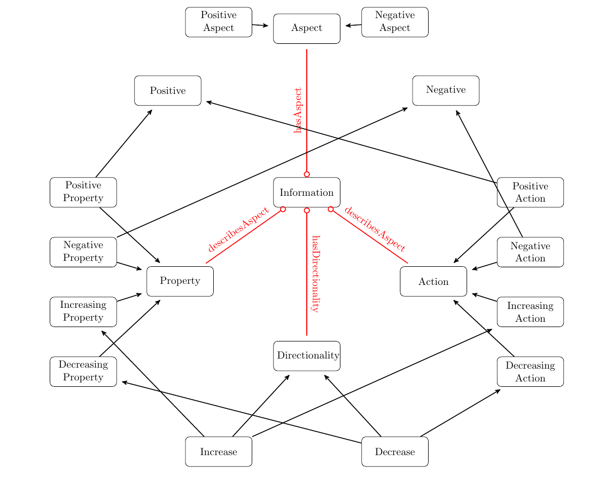

Submission By

DA24C021 - Venkatesh Duraiarasan

CS24M033 - Pradeep Peter Murmu

[TOC]


# Assignment 1: Ontology Design

## Task - 1

### Domain of Interest 
The domain of interest is **financial instruments** from the perspective of **retail investors**. The ontology aims to model the sentiment associated with various financial instruments, such as stocks, bonds, mutual funds, etc., based on information that retail investors encounter (news headlines, snippets from annual reports, etc.). This information includes company performance, market conditions, and specific aspects of the company's operations or financial health. The goal is to automatically classify financial instruments into either Positive or Negative categories based on the sentiment derived from triplets containing: 

1. Company Name: The entity or organisation to which the financial instrument is linked.
2. Aspect of the Company: Specific attributes or factors related to the company (e.g., stock price, earnings report, management, etc.).
3. Directionality of the Aspect: The sentiment or direction of the aspect (positive or negative).

Consider this sample information:

> Info 1 : TCS profit jumped 10% in last quarter

> Info 2 : HCL  debt reduced by 5 %

The above pieces of information can be converted into equivalent triplets ("TCS", "profit", "jumped") and ("HCL", "debt", "reduced") respectively.

The above information can be stored in an ontology and can be used for reasoning like: 

*  Is  "Info 1" a positively info?
* Which company is affected by it?
* Which Mutual funds contain the stock of the affected company?

Our attempt is to use ontology to model this basic information.

Modelling restriction:

- To reduce the complexity of model, only information which are in above triplet form is considered for modelling. 
- Only binary classification (Negative and Positive labels) are considered for classifying the information and instruments.
- Only bond, stocks and mutual funds are considered as instruments


### Concrete Pieces of Knowledge to Capture

Top level classes considered in this ontology:



1. Information
   ```mermaid
   classDiagram
       class Information {
         
       }
   
       Information <|-- PositiveInfo : subclass
       Information <|-- NegativeInfo : subclass
   
       Information "1" --> "*" Company : isAboutCompany
       Information "1" --> "*" Aspect : describesAspect
       Information "1" --> "*" Directionality : hasDirectionality
   
   ```

   

2. **Companies and their financial instruments**: Ontology model has to capture information about various companies and the financial instruments they issue (restricted to Bond and Stocks).

   * Company issues Stocks and Bonds, and based on the available information, we have to classify the company into Positive and Negative sub-classes

   

   ```mermaid
   
   classDiagram
       class Company {
       }
   
       Company <|-- PositiveCompany : subclass
       Company <|-- NegativeCompany : subclass
   
       Company "1" --> "*" Stock : issues
       Company "1" --> "*" Bond : issues
       Company "1" --> "*" Aspect : hasAspect
       Company "1" --> "*" CompanyPart : hasPart
   ```

   Sample Class Structure of Instruments

   ```mermaid
   classDiagram
       class FinancialInstrument {
           
       }
   
       class MutualFund {
           
       }
   
       class EquityFund {
          
       }
   	class DebtFund {
          
       }
       class HybridFund {
          
       }
       class Stock {
          
       }
       class Bond {
          
       }
   
       FinancialInstrument <|-- Stock : subclass
       FinancialInstrument <|-- Bond : subclass
       FinancialInstrument <|-- MutualFund : subclass
       MutualFund <|-- EquityFund : subclass
       MutualFund <|-- DebtFund : subclass
       MutualFund <|-- HybridFund : subclass
   
   ```

   

3. **Aspects of a company**: 

   1. Key attributes or aspects of company that are important to retail investors (e.g., stock performance, market share, earnings, or corporate governance).
      * Here, the aspect can be a positive aspect (e.g., `profit`, `share price`, `stores`) or a negative aspect (e.g., `debt`, `loss`)
      * Company Parts like `branches`, `stores`, etc. are under Positive aspects 

   ```mermaid
   classDiagram
       class Aspect {
       }
   
       Aspect <|-- PositiveAspect : subclass
       Aspect <|-- NegativeAspect : subclass
   
       Aspect "1" <-- "*" Information : isAboutAspect
       Aspect "1" <-- "*" Company : hasAspect
   ```

   

4. **Actions and Properties**

   * Properties are mostly adjectives (like `lower`, `better`, etc.) present in the information triplet that describe the aspect of the company and give the directionality of that aspect 

     * **Decreasing  & Increasing Property**
       * Decreasing property (e.g., `lower`, `reduction`) when combined with positive aspects (e.g., `profit`, `margin`) will give a negative label to information 
       * But when combined with negative aspects (e.g., `loss`, `margin`), it will give a positive label to information        
       * Similar argument can be made for Increasing property
     * **Negative and Positive Property**
       * These are properties which inherently carry negative or positive sentiments irrespective of the aspect they are tied to, 
       * e.g., (`underperforming`, `loss-making`, `bankrupt`, etc.) for Negative Property 
       * e.g., (`robust`, `successful`, etc.) for Positive Property

     ```mermaid
     classDiagram
         class Property {
           
         }
     
         Property <|-- DecreasingProperty: subclass
         Property <|-- IncreasingProperty: subclass
         Property <|-- NegativeProperty: subclass
         Property <|-- PositiveProperty: subclass
     
     ```

     

   * A similar argument can be made for actions, except that actions are generally verbs (like **creates** jobs, **closed** stores, etc.) 

     * `achieves`, `declines` - examples of Negative Actions  
     * `struggles`, `loses` - examples of Positive Actions 
     * `reports` profit, `reports` loss, etc. - are examples of Increasing or Decreasing Actions that can convey sentiment based on the aspect they are tied to 

     ```mermaid
     classDiagram
         class Action {
         }
     
         Action <|-- DecreasingAction : subclass
         Action <|-- IncreasingAction : subclass
         Action <|-- NegativeAction : subclass
         Action <|-- PositiveAction : subclass
     
     ```

     

5. **Directionality of the information**: Whether a change in a specific aspect or an event related to a company is viewed positively or negatively. 

   


   ```mermaid
   classDiagram
       class Directionality {
       }
       class DecreasingAction {
       }
       class DecreasingProperty {
       }
       class IncreasingAction {
       }
       class IncreasingProperty {
       }
       
   
       Directionality <|-- Increase: subclass
       Directionality <|-- Decrease : subclass
       
       Decrease <|-- DecreasingAction : subclass
       Decrease <|-- DecreasingProperty : subclass
     
       Increase <|-- IncreasingAction : subclass
       Increase <|-- IncreasingProperty : subclass
   
      
   ```

   
   

   

6. **Classification rules**: Rules that define how the combination of company name, aspect, and directionality translates into a Positive or Negative classification for an instrument.

## Task - 2

###  DL ontology (TBox) 

#### Class Definition for Instruments

**Class:** *Bond*

> Bond $\sqsubseteq$​ Instrument
> Bond $\sqsubseteq$ $\leq 1$ issuedBy.Company

**Class:** *Stock*

> Stock $\sqsubseteq$ Instrument
> Stock $\sqsubseteq$ $\leq 1$ issuedBy.Company

**Class:** *AtomicInstrument*

> AtomicInstrument $\equiv$ Bond $\sqcup$​ Stock 

**Class:** *MutualFund*

> MutualFund $\sqsubseteq$ Instrument

**Class:** *DebtFund*

> DebtFund $\equiv$ MutualFund $\sqcap$ $\forall$ hasInstrument.Bond

**Class:** *EquityFund*

> EquityFund $\equiv$ MutualFund $\sqcap$ $\forall$​​ hasInstrument.Stock

----

**Class:** *Decrease*

> Decrease $\sqsubseteq$ Directionality

**Class:** *DecreasingAction*

> DecreasingAction $\sqsubseteq$ Action
> DecreasingAction $\sqsubseteq$ Decrease

**Class:** *DecreasingProperty*

> DecreasingProperty $\sqsubseteq$ Decrease
> DecreasingProperty $\sqsubseteq$ Property

**Class:** *Increase*

> Increase $\sqsubseteq$ Directionality

**Class:** *IncreasingAction*

> IncreasingAction $\sqsubseteq$ Action
> IncreasingAction $\sqsubseteq$ Increase

**Class:** *IncreasingProperty*

> IncreasingProperty $\sqsubseteq$ Increase
> IncreasingProperty $\sqsubseteq$ Property

----

**Class:** *NegativeAction*

> NegativeAction $\sqsubseteq$ Action
> NegativeAction $\sqsubseteq$ Negative

**Class:** *NegativeAspect*

> NegativeAspect $\sqsubseteq$ Aspect

**Class:** *NegativeProperty*

> NegativeProperty $\sqsubseteq$ Negative
> NegativeProperty $\sqsubseteq$ Property

----

**Class:** *PositiveAction*

> PositiveAction $\sqsubseteq$ Action
> PositiveAction $\sqsubseteq$ Positive

**Class:** *PositiveAspect*

> PositiveAspect $\sqsubseteq$ Aspect

**Class:** *PositiveProperty*

> PositiveProperty $\sqsubseteq$ Positive
> PositiveProperty $\sqsubseteq$​ Property

----

**Class:** *NegativeInfo*

> NegativeInfo $\equiv$ ($\exists$ describesAspect.Decrease $\sqcap$ $\exists$ isAboutAspect.PositiveAspect) $\sqcup$ ($\exists$ describesAspect.Increase $\sqcap$ $\exists$ isAboutAspect.NegativeAspect)  $\sqcup$ ($\exists$ describesAspect.NegativeAction)   $\sqcup$  ($\exists$ describesAspect.NegativeProperty)

**Class:** *NegativeCompany*

> NegativeCompany $\equiv$   $\exists$ (isAboutCompany)$^{-}$​.NegativeInfo

**Class:** *NegativeStock*

> NegativeStock $\equiv$  $\exists$ issuedBy.NegativeCompany

**Class:** *NegativeInstrument*

> NegativeInstrument $\equiv$ AtomicInstrument $\sqcap$ $\exists$ issuedBy.NegativeCompany

**Class:** *NegativeMutualFund*

> NegativeMutualFund $\equiv$ $\exists$​ hasInstrument.NegativeInstrument

----

**Class:** *PositiveInfo*

> PositiveInfo $\equiv$ ($\exists$ describesAspect.Decrease $\sqcap$ $\exists$ isAboutAspect.NegativeAspect) $\sqcup$ ($\exists$ describesAspect.Increase $\sqcap$ $\exists$ isAboutAspect.PositiveAspect)   $\sqcup$ ($\exists$ describesAspect.PositiveAction)   $\sqcup$  ($\exists$ describesAspect.PositiveProperty)

**Class:** *PositiveCompany*

> PositiveCompany $\equiv$ $\exists$ (isAboutCompany)$^{-1}$.PositiveInfo

**Class:** *PositiveInstrument*

> PositiveInstrument $\equiv$  $\exists$ issuedBy.PositiveCompany

**Class:** *PositiveMutualFund*

> PositiveMutualFund $\equiv$ $\exists$ hasInstrument.PositiveInstrument

**Class:** *PositiveStock*

> PositiveStock $\equiv$  $\exists$​ issuedBy.PositiveCompany


## Task 3 

### Design Choices for the Financial Instrument Ontology

- Consider the below class diagram where black lines indicate the subclass relationship. 

  

  

  - The core idea is to classify the aspect of the company and the directionality of the aspect into separate classes for easy modelling. 

  - Classifying aspect into verb and adjective enables to model words directly without using any external lexical processing.

  - Separating directional words into aspect dependent and aspect independent enables easy definition of general class axioms such as 

    > Decrease $\sqcap$ NegativeAspect $\sqsubseteq$ Positive
    > Decrease $\sqcap$ PositiveAspect $\sqsubseteq$ Negative
    > Increase $\sqcap$ NegativeAspect $\sqsubseteq$ Negative
    > Increase $\sqcap$ PositiveAspect $\sqsubseteq$ Positive 

### Motivating Situations and Examples

##### Example 1: Stock Sentiment Analysis
- Consider a scenario where a retail investor wants to assess the sentiment of a stock (say, "StockA") issued by "CompanyA". The investor checks recent news that "CompanyA's earnings increased." This information would be represented in the ontology as:
  - `Information isAbout CompanyA`
  - `Information hasAspect earnings`
  - `earnings` is an instance of `Class:PositiveAspect`
  - `increased` is an instance of `Class:Increase`  
  - `PositiveAspect` $\sqcap$​ `Increase`  ⊑ `Positive`
  - $\therefore$ we can infer Information is `Positive` and associated company stock is also as `PositiveCompany`

The combination of the company and the positive aspect would lead to the classification of "StockA" as having positive sentiment.

##### Example 2: Bond Issuance
- A bond instrument "BondA" issued by "CompanyB" might be under consideration by a retail investor. The ontology models this as:
  - `BondA issuedBy CompanyB`
  

Additionally, if the investor finds out that "CompanyB’s debt increased," it could be represented as:
  - `CompanyB hasAspect Debt and hasDirectionality Increase`
  - `Debt and Increase is a  NegativeAspect`

This negative sentiment might cause the investor to avoid "BondA."

### Design Trade-offs and Justifications

1. **Simplified Representation for Retail Investors**: 
   - The ontology is aiming for simplicity and direct mappings of company aspects to instrument sentiment. This focus ensures clarity without the complexity of deeper financial models.

2. **Triplet-based Reasoning**: 
   - The decision to model sentiment using triplets (Company, Aspect, Directionality) allows for a scalable and flexible approach. This structure easily accommodates the dynamic nature of market information and sentiment shifts.

3. **Explicit Positive/Negative Classification**: 
   - By introducing `PositiveAspect` and `NegativeAspect` as distinct classes, the ontology directly supports the sentiment classification of financial instruments. This design enables straightforward rule-based classification for retail investors.

### Limitations
The current design is very limited in terms of capturing general information related to news and events of a company. This model could be extended by:
- **Advanced reasoning**: Implementing more complex reasoning over multiple aspects (e.g., combining positive and negative aspects to assess the overall sentiment). 
- **Time-based reasoning**: Capturing the evolution of sentiment over time to support trends.

