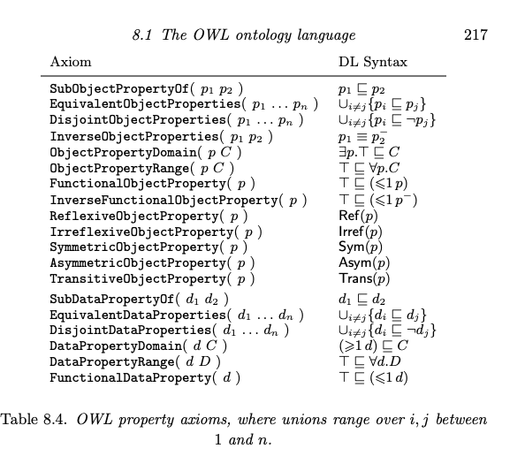

# Assignment 1: Ontology Design

## Task - 1: A plain text description of the domain of interest and a list of concrete pieces of knowledge you would like to capture in the domain. 

The domain of interest is **Financial Modeling**. The goal is to develop a basic ontology model which aids 

- **Equity research** by capturing limited details of current and historical information related to given equity instrument in order to assess a security/stock's financial health and also query and filter securities which satisfies certain financial ratio requirements.
- **Portfolio Management** - grouping securities which satisifies certain finacial ratios and market conditions

Developing ontological model will help in framing questions related to equity research in a systematic and concise manner. For example some sample questions are listed below

- Which Stocks are in GrowthStage has high return in last quarter?
- Which Banking stock gave most return in year YYYY?
- Current year Stock price > Last year stock price?
- List stocks that are eligible to be in X portfolio?

#### Knowledge to be captured:

- **Financial Instrument**

  - Equity - Stock of a **Company** listed in some Market

  - Etf - Collection of stock
  
  - MutualFund - Collection of one or more Equity or Etf
  
  - FundofFund - Collection of one or more Mutual Fund
  
- **Equity**

  An Equity has following properties/relation :

  - ~~Name  (eg. APPL, SBI)~~
  - Company  (eg. Apple Inc, State Bank of India) - equity belongs to a company
  - Equity metrics
  - Risk metrics
  - Balance sheet metrics
  - Peers : Companies which are operating in same sectors or industry

- **Equity Metric**

  - Price : price of a stock
  - Return : return over specified period
  - Dividend

- **Risk Metric**

  - beta
  - volatility
  - sharpe ratio

- **Balance Sheet Metric**

  - **Balance Sheet Ratios**
    - Current : Measures solvency
    - Quick : Measures liquidity
    - Debt-to-Worth : Measures financial risk
    - MarketValuation : MarketCapitalization+Debt
  - **Efficiency Ratios**
    - Sales-To-Assets : Measures the efficiency of Total Assets in generating sales
    - Return On Assets : Measures the efficiency of Total Assets in generating Net Profit
    - Return On Investment : Measures the efficiency of Net Worth in generating Net Profit

- **Market structure**

  - Category (eg. SmallCap, MidCap, LargeCap, etc)
  - MarketIndex : Index/Equity to which the stock is benchmarked against (Nifty, BankNifty)
  - Sector : market classification of stock (Banking , IT , Manafacturing)
  - Stage : Lifecycle stage at which company is in (DevelopmentStage, GrowthStage, SustainabilityStage, ExpansionStage)

- **Time aspects**

  - Year (FY2022, FY2023 etc )
  - Quarter (Q2023-1, Q2023-2, Q2023-3, .....)

- **Stock Screener** - collection of equity

  - Growth
  - ~~Balanced~~
  - LowVolatile
  - HighGrowth - Stocks with low pe and high  profit growth 
  - Oversold - Stocks with RSI (Relative Strength Index) < 30

## Task - 2 : the DL ontology (TBox) 

Now we will model the key concepts and relationships in order to capture above domain knowledge

#### Classes and Subclasses (Concept Inclusions -Subsumption Axiom)

- Company
  - ~~HoldingCompany~~ This is a derived class should be removed and DL expression should be added
- ~~Name~~
  - ~~CompanyName~~
  - ~~StockName~~
- ~~Category~~ 
- BusinessStage 
- Sector 
- MarketIndex 
- StockScreener
- Instrument
  - Stock 
  - Etf
  - MutualFund
  - FundofFund
- [TemporalEntity](https://spec.edmcouncil.org/fibo/ontology?query=https://www.omg.org/spec/Commons/DatesAndTimes/TemporalEntity) (referred from FIBO)
  - TimeInterval
    - CalendarPeriod
      - CalendarYear 
      - CalendarQuarter 
- Metric
  - EquityMetric
    - Return 
    - Dividend
    - MarketCapitalization
  - RiskMetric
    - Beta
    - Volatility  (Volatility ⊑ RiskMetric)
    - Sharpe ratio
  - BalanceStatement
    - Profit
    - ProfitGrowth
    - ~~Price~~
    - Income
    - Asset
    - Liability
    - MarketValuation

#### Roles and its properties 

- **owns** : A company can own other company
  - owns$⊆$Company$×$Company
  - `Trans` (`owns`), (Transitive : If Company A owns Company B and  Company B owns Company C then Company A owns Company B)
  - `Irref` (`owns`),  (Irrefrexive : No company can own itself)
  - `Asym` (`owns`),  (Asymmetric : If Company  A owns company B then Company B cannot own Company A)
  - `isOwnedBy`$≡$`owns`, (Inverse relation , If A owns B then B is owned by A) 
- **has** $\sube$ (Instrument $\times$ Instrument) A instrument can be part of other instrument
  - Transitive, Irrefrexive, Asymmetric
- **hasPeer** $\sube$ (Company$\times$ Company)
  - Transitive, Irreflexive

- **isIn**: (Company$\to$ BusinessStage)
- **isInSector**: (Company$\to$ Sector), 
- **benchmarkedBy**: ( Instrument$\to$MarketIndex)
- isPartOf: (Stock$\to$StockScreener)
- hasStock: (Stock Screener$\to$Stock)
- hasPrice : (Stock$\to$ Price)
- hasReturn : (Stock$\to$ Return)
- hasDividend : (Stock$\to$ Dividend)
- hasMarketCapitalization : (Stock $\to$ MarketCapitalization)
- hasMarketValuation : (Stock $\to$ MarketValuation)
- observedIn : (Metric$\to$ TimePeriod)
- hasProfit : (Profit $\to$ Company)
- observedIn : (MonetaryAmount$\to$ TimePeriod)

#### Axioms

- ~~Company, Stock has always a unique name~~

  > ~~Company $⊑ (=1$ hasName.Name$)$~~
  > ~~Stock	 $⊑ (=1$ hasName.Name$)$~~ 

- ~~CompanyName and StockName are disjoint~~

  > ~~CompanyName $⊓$ StockName $⊑ ⊥$~~

- Company is part of a sector

  > Company $⊑∃$belongsTo.Sector

  > Sector $⊑∀$has.Company

- Company must be in some growth stage

  > Company $⊑ ∃$isInStage.BusinessStage

- Heirarchial role of Instruments

  - Etf $⊑ ∃$has.Stock
  - MutualFund $⊑ ∃$has.Stock $⊔$ $∃$has.ETF
  - FundofFund $⊑∃$has.ETF $⊔$ $∃$has.MutualFund

- Portfolio holds at least one stock:

  > Portfolio $⊑ ∃$holds.Stock
  
- A stock must have a price, return, and volatility:

  > Stock $⊑ ∃$hasPrice.Price $⊓ ∃$hasReturn.Return $⊓ ∃$hasVolatility.Volatility

- Price, return, and volatility are observed in specific time periods:

  > Price $⊑ ∃$observedIn.TimeInterval

  > Return $⊑ ∃$observedIn.TimeInterval

  > Volatility $⊑ ∃$observedIn.TimeInterval

- Midcap : companies with a moderate market capitalisation ranging from Rs. 5,000 crores to Rs. 20,000 crores

  > Midcap $⊑$  Stock ⊓ (hasMarketCapitalization ≥ 5000) ⊓ (hasMarketCapitalization ≤ 20000)

- Smallcap : company whose market capitalization is less than Rs 5,000 crores are known as small-cap companie

  > Smallcap $⊑$  Stock ⊓ (hasMarketCapitalization < 5000)

- Largecap : company with market caps of ₹20,000 crore or more

  > Largecap $⊑$  Stock ⊓ (hasMarketCapitalization > 20000)

- ~~Balanced portfolios cannot hold more than 30% of equities from the same sector:~~

  > ~~BalancedPortfolio $⊑ ∃$ holds.(Stock $⊓$ (hasVolatility $≥$ 0.3)) $⊓$ ($\ge3$ holds.Stock)~~

- LowVolatile portfolios holds more than 3 equities each having volatility lesser than 0.3:

  > LowVolatile $⊑ ∃$ holds.(Equity $⊓$ (hasVolatility $<$ 0.3)) $⊓$ ($\ge3$ holds.Stock)

#### Role Constraints

To model the restrictions on ownership, we apply constraints to the `owns` property.

#### a) **Irreflexivity**:

No company can own itself. In DL, we express irreflexivity for the `owns` role like this:

Irref (`owns`)

#### b) **Asymmetry**:

If a company xxx owns another company yyy, then yyy cannot own xxx. This prevents reciprocal ownership. We define asymmetry as:

Asym(`owns`)

#### c) **Transitivity** (Optional):

If ownership should propagate through chains (e.g., xxx owns yyy, and yyy owns zzz, then xxx indirectly owns zzz), you can define the `owns` role as transitive:

Trans(`owns`)

### Task - 3 : a write-up about the design choices made and the details of the design - the explanations for classes, properties, DL axioms, motivating situations/examples - of terms in the ontology. 

Classes
- Company - A registered business according to laws.
- CompanyName - Represents the name of the company
- StockName - Represents the name of the stock of the company
  
- Category - Classification of financial instruments based on characteristics like market capitalization (e.g., SmallCap, MidCap, LargeCap).
- BusinessStage - Represents the lifecycle stage of a company, such as DevelopmentStage, GrowthStage, SustainabilityStage, ExpansionStage.
- Sector - Represents the industry sector to which a company belongs, such as Technology, Finance, or Healthcare.
- MarketIndex - A statistical measure representing the performance of a segment of the stock market. Eg. NIFTY, BankNifty
- Instrument 
  - Stock - Represents an equity that signifies ownership in a company.
  - ETF - An exchange-traded fund that holds a collection of stocks or other assets and is traded on an exchange.
  - MutualFund - A fund that pools money from multiple investors to invest in a diversified portfolio of stocks, bonds or other assets.
  - FundofFund - An investment fund that holds shares in other investment funds.

- TemporalEntity
    - TimeInterval - Represents a period of time during which a metric or event is measured. 
    - CalenderPeriod -
      - CalenderYear - Represents a full year.
      - CalenderQuarter - Represents a quarter of a year.
- Metric
  - EquityMetric -  Measures specific attributes of equity investments.
    - Return - The profit or loss from an instrument.
    - Dividend - The portion of a company’s earnings distributed to shareholders (who owns stocks).
    - MarketCapitalization - The total market value of a company’s stocks.
  - RiskMetric - Measures the risk associated with investments.
    - Beta - A measure of an investment’s volatility relative to the market.
    - Volatility - The degree of variation of a trading stock price over time.
    - Sharpe ratio - A measure of risk-adjusted return, comparing the return of an investment to its risk.
- MonetaryAmount 
  - BalanceStatement - Represents financial metrics
    - Profit - The net income of a company after expenses.
    - Price - The current trading value of instrument.
    - Income - Earnings generated by a company from its operations and sales.
    - Asset - Resources owned by a company that have economic value.
    - Liability - Financial obligations or debts owed by a company.

Properties
- owns - (Company$\to$Company) A company can own other company.
- has - (Instrument $\to$ Instrument) A instrument can be part of other instrument.
- hasPeer - (Company$\to$ Company) A company which is in similar sector (IT, Banking etc.) as another company.
- isInStage - (Company$\to$ BusinessStage) Links a company to the specific stage of its business lifecycle (e.g., growth stage, maturity stage).
- belongsTo - (Company$\to$ Sector) Indicates the sector or industry to which a company belongs (e.g., technology, finance).
- benchmarkedBy - (Instrument$\to$MarketIndex) Relates an instrument to the market index against which it is benchmarked.
- isIn: (Stock$\to$Portfolio) Describes the inclusion of a stock within a specific investment portfolio.
- holds - (Portfolio$\to$Stock) Represents the relationship where a portfolio holds a stock.
- hasPrice - (Stock$\to$ Price) The price of the stock.
- hasReturn - (Stock$\to$ Return) The return (profit/loss) on a stock.
- hasDividend : (Stock$\to$ Dividend) The dividend distributed by the company per stock to its shareholders.
- hasMarketCapitalization - (Stock $\to$ MarketCapitalization) Relates a stock to its total market capitalization.
- observedIn - (Metric$\to$ TimePeriod) Links metrics to the time period during which they are observed.
(MonetaryAmount$\to$ TimePeriod) Links monetary amount to the time period during which they are observed.
- hasProfit - (Profit $\to$ Company) Indicates the profit generated by the company.
- hasValue - (Metric$\to$ NumericValue) Describes the value of a specific metric as a numerical value.

Design choices 

- Use of Transitive roles : The company can have ownership chain say Company A can own Company B and Company B owns Company C which was captured by transitive role `owns`. Similar transitive role `has` also captures relation like Etf has Stock and Mutual fund can have both Stock and ETFs.
- Concept Disjointness : The company and stock name should be disjoint to represent different entities. Stock is a financial instrument representing the company's business.
- Inverse Role :
  - (Company $⊑∃$belongsTo.Sector) A company will definitely belong to a sector but (Sector $⊑∀$has.Company) a sector can have 0 or many companies.

